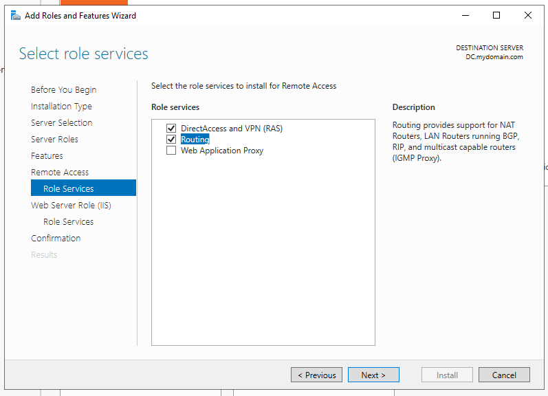
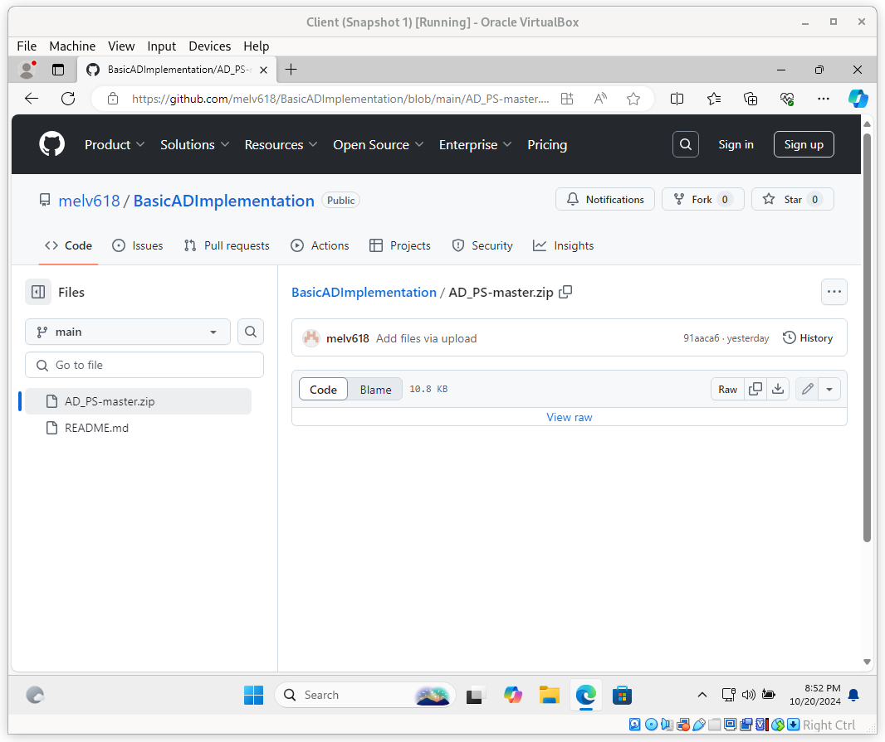

# Description
In this lab, we will create an Active Directory environment using Oracle VirtualBox and add users with PowerShell. We'll set up two virtual machines: a Domain Controller (DC) with two network interfaces—one connecting to the internet and the other to a private network for our client machine. We'll configure the domain server, set internet settings, install RAS/NAT and DHCP, and use PowerShell to add over 1,000 user accounts. This hands-on experience will enhance your understanding of Active Directory and Windows networking.

## Languages and Utilities Used

- Oracle VirtualBox
- PowerShell

## Environments Used

- Windows 11
- Server 2022
# Setup

## 1. Install Oracle VirtualBox
- **Description**: Download and install Oracle VirtualBox on your machine.
- **Extension Pack**: [Download here](https://www.virtualbox.org/)

---

## 2. Download ISO Files
- **Description**: Download the necessary ISO files for Windows Server 2022 and Windows 11.
  - [Windows Server 2022](https://www.microsoft.com/en-us/evalcenter/download-windows-server-2022)
  - [Windows 11](https://www.microsoft.com/en-us/software-download/windows11)

---

## 3. Create Virtual Machines

### Domain Controller VM
- **Description**: Set up a virtual machine for the Domain Controller using Windows Server 2022.
- **Image**:  
  

### Windows 11 Client VM
- **Description**: Set up a virtual machine for the Windows 11 client.
- **Image**:  
  

---

## 4. Configure Network Settings

### DC Network Settings
- **Description**: Configure network settings for the Domain Controller.
- **Image**:  
  
  

### Client Network Settings
- **Description**: Set the network settings for the Windows 11 client VM.
- **Image**:  
  

---

## 5. Install Windows Server 2022
- **Description**: Boot the Domain Controller VM and install Windows Server 2022 Desktop Experience.
- **Image**:  
  

---

## 6. Configure Active Directory
- **Description**: Install Active Directory Domain Services and promote the server to a Domain Controller.
- **Images**:  
  
  
    

---

## 7. Install RAS/NAT
- **Description**: Setting up RAS (Remote Access Service) and NAT (Network Address Translation) allows client machines to access a virtual private network (VPN) while also enabling them to connect to the internet through the Domain Controller.
- **Image**:  
  
  
  
  

---

## 8. Install and Configure DHCP
- **Description**: Set up DHCP on the Domain Controller to manage IP addresses for the internal network.
- **Images**:  
  
    
    
    

---

## 9. Create PowerShell Script for User Creation
- **Description**: Prepare a PowerShell script to automate the creation of users in Active Directory.
  - **[Get the PowerShell script here](AD_PS-master.zip)**
  
- **Run PowerShell script**
- **Image**:  
    
    
  

- **Domain Controller's POV:**
          
---

## 10. Set Up Windows 11 Client
- **Description**: Install Windows 11 on the client VM.
- **Image**:  
  
  
---

## 11. Join the Domain
- **Description**: Configure the Windows 11 client to join the Active Directory domain.
- **Image**:  
  

---

## 12. Verify Setup
- **Description**: Confirm that the client is connected to the domain and can access resources.
- **Image**:  
  
